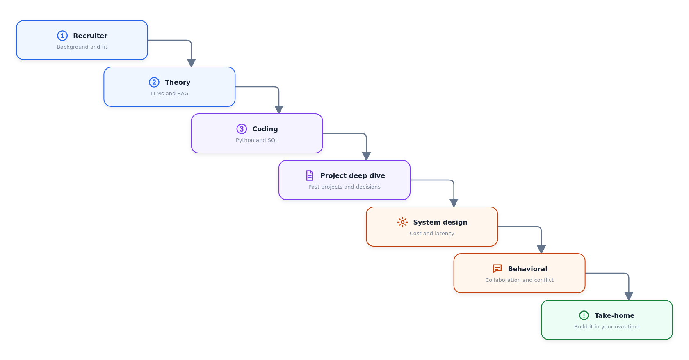
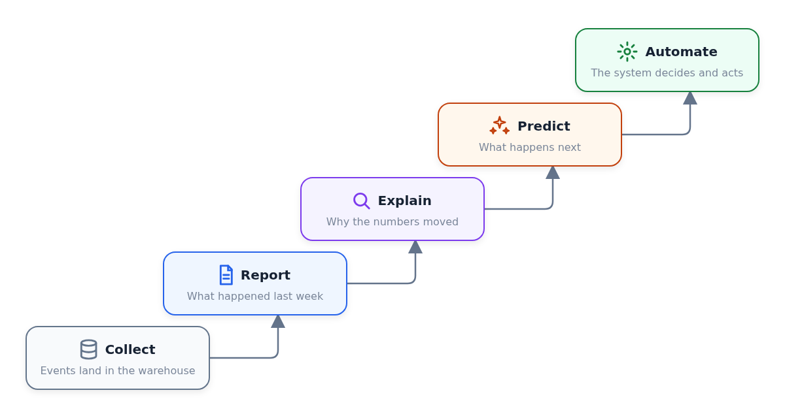

# Diagram Creator

[](https://github.com/alexeygrigorev/diagram-creator/actions/workflows/tests.yml)

Diagram Creator turns a compact JSON specification into a deterministic SVG or
PNG. The same renderer handles horizontal workflows, explicitly positioned
rows and columns, and circular loops with reusable icons.

## Quick start

Install the project and render an example:

```bash
uv sync --dev
uv run diagram-creator examples/faq-curation-loop.json examples/faq-curation-loop.svg
```

Choose the format with the output extension. PNG output is rendered from the
same SVG with Chromium, so both formats use identical layout, fonts, and icons:

```bash
uv run diagram-creator input.json output.svg
uv run diagram-creator input.json output.png
```

Canvas dimensions belong in JSON. `--width` and `--height` can override them
for a one-off render.

## Examples

Each image below is generated from the linked JSON source.

### Horizontal workflow

The default layout evenly spaces a workflow from left to right and can route a
feedback edge below the main flow.


[JSON source](examples/agent-workflow.json) · [SVG output](examples/agent-workflow.svg)

### Manual rows and columns

Manual layout gives nodes explicit positions while retaining the same cards,
icons, anchors, and curved connectors.


[JSON source](examples/manual-pipeline.json) · [SVG output](examples/manual-pipeline.svg)

### Staircase

Staircase layout cascades equal cards one step right and one step down, and
joins each pair with a single elbow. Set `"direction": "ascending"` to climb
from the bottom left to the top right instead.



[JSON source](examples/interview-stages.json) · [SVG output](examples/interview-stages.svg)



[JSON source](examples/analytics-maturity.json) · [SVG output](examples/analytics-maturity.svg)

### Circular improvement loop

Ring layout spaces equal cards evenly on a circle and draws every connector as
an arc of that same circle.


[JSON source](examples/faq-curation-loop.json) · [SVG output](examples/faq-curation-loop.svg)

## Diagram specification

Every diagram has nodes and edges. The original compact form remains valid and
uses a 1440×360 horizontal layout:

Set `"bidirectional": true` on an edge to render a single straight or curved
connector with arrowheads at both ends.

```json
{
  "nodes": [
    {"id": "plan", "title": "Plan", "subtitle": "PM", "color": "purple"},
    {"id": "build", "title": "Build", "subtitle": "Engineer", "color": "blue"}
  ],
  "edges": [
    {"from": "plan", "to": "build"},
    {"from": "build", "to": "plan", "label": "FAIL", "color": "red", "route": "below"}
  ]
}
```

Use a ring layout for an improvement cycle. Nodes are declared clockwise
starting at the top, and the renderer spaces them evenly on a real circle:

```json
{
  "title": "Continuous improvement loop",
  "canvas": {"width": 940, "height": 800, "background": "#ffffff"},
  "layout": {"type": "ring", "card_width": 260, "card_height": 100},
  "nodes": [
    {"id": "one", "title": "Contribute", "color": "blue", "icon": "issue"},
    {"id": "two", "title": "Curate", "color": "purple", "icon": "message"},
    {"id": "three", "title": "Deploy", "color": "green", "icon": "database"},
    {"id": "four", "title": "Answer", "color": "purple", "icon": "mention"},
    {"id": "five", "title": "Evaluate", "color": "red", "icon": "warning"}
  ],
  "edges": [
    {"from": "one", "to": "two", "route": "ring"},
    {"from": "two", "to": "three", "route": "ring"},
    {"from": "three", "to": "four", "route": "ring"},
    {"from": "four", "to": "five", "route": "ring"},
    {"from": "five", "to": "one", "route": "ring"}
  ],
  "center": {"title": "CURATION", "subtitle": "LOOP", "detail": "Keep improving"}
}
```

The complete source for the diagram above is
[`examples/faq-curation-loop.json`](examples/faq-curation-loop.json).

Use a staircase for stages that only move forward. Nodes are declared in step
order and the renderer cascades them, so edges need no route of their own:

```json
{
  "title": "Interview stages",
  "canvas": {"width": 1680, "height": 880, "background": "#ffffff"},
  "layout": {"type": "staircase", "direction": "descending", "card_width": 320, "card_height": 96},
  "nodes": [
    {"id": "recruiter", "title": "Recruiter", "subtitle": "Background and fit", "icon": "number-1"},
    {"id": "theory", "title": "Theory", "subtitle": "LLMs and RAG", "icon": "number-2"},
    {"id": "coding", "title": "Coding", "subtitle": "Python and SQL", "icon": "number-3"}
  ],
  "edges": [
    {"from": "recruiter", "to": "theory"},
    {"from": "theory", "to": "coding"}
  ]
}
```

### Layouts

- `horizontal` places every node in one evenly spaced row.
- `ring` spaces three or more cards evenly on a circle, clockwise from the top,
  around a center annotation. The renderer fits the largest circle the canvas
  allows, so give a ring a roughly square canvas - a wide one only adds side
  margins. Set `margin` to change the gap kept around the cards, which defaults
  to 40. Rendering fails with a suggested canvas size when the cards would
  overlap.
- `staircase` cascades equal cards one step right and one step down, in JSON
  order. `direction` is `descending` (top left to bottom right) or `ascending`
  (bottom left to top right). The renderer spreads the treads over the canvas
  width, stopping before consecutive cards pull apart, and keeps a riser of the
  card height plus 18 px. Set `step_x` and `step_y` for exact advances, and
  `margin` to change the 40 px gap kept around the cards. Rendering fails with a
  suggested canvas size when the cascade does not fit.
- `grid` places nodes by `row` and `column`, sizes each column and row to its
  largest node, and preserves equal `column_gap` and `row_gap` gutters. Set
  `column_width` and `row_height` when every grid cell should use fixed dimensions.
- `manual` uses each node's `x` and `y`; set shared `card_width` and
  `card_height` in `layout`, or override `width` and `height` on a node.

Two layout options apply to cards in any layout. `font_scale` scales card type
and its vertical rhythm together, for a diagram that has to stay legible after
being scaled down to a phone. `icon_position` is `leading` (icon beside the
title) or `above` (icon over a centered title); `above` needs roughly half the
card width for the same title, which makes cards squarer - worth it in a ring,
where flat cards give uneven gaps and unequal connector lengths.

Titles and subtitles are never stretched or squeezed. Each diagram picks one
title size and one subtitle size - the largest that fits every card
undistorted - so the type stays consistent and every glyph keeps its natural
width.

Manual layouts still use reusable cards and icons—the JSON controls placement,
not raw SVG markup:

```json
{
  "canvas": {"width": 900, "height": 500},
  "layout": {"type": "manual", "card_width": 220, "card_height": 100},
  "nodes": [
    {"id": "source", "title": "Sources", "x": 40, "y": 60, "icon": "document"},
    {"id": "index", "title": "Build index", "x": 340, "y": 280, "icon": "settings"}
  ],
  "edges": [
    {
      "from": "source",
      "to": "index",
      "route": "curve",
      "from_anchor": "right",
      "to_anchor": "top",
      "controls": [[300, 110], [450, 190]]
    }
  ]
}
```

Use `"variant": "icon"` for a standalone icon with its `title` underneath and
no surrounding card. Add `"show_label": false` when the icon should appear
without a visible label; the title remains available to the diagram's
accessible description. Set `"icon_size"` when a symbol needs an explicit
override. Standalone `user`, `browser`, and `database` icons otherwise use the
shared 56×56 px, 160×112 px, and 84×84 px dimension tokens respectively.

Use `"variant": "plain"` for a card without its rectangle. The node keeps the
same grid cell, icon column, and typography, but drops the fill, border, and
shadow, so it reads as a label rather than a component. A plain node with an
icon left-aligns its subtitle on the title axis because there is no card to
center against.

Add `"dividers"` to a grid diagram to separate rows with a dashed rule. Each
entry takes `after_row`, and the rule is drawn halfway between that row and the
one below it across the full grid width:

```json
"dividers": [{"after_row": 0}, {"after_row": 1}]
```

### Components and tokens

Node colors are `purple`, `blue`, `amber`, `green`, `red`, and `gray`.
Available icons are `github`, `search`, `database`, `openai`, `issue`,
`document`, `user`, `browser`, `websocket`, `api`, `settings`, `pull-request`,
`rank-fusion`, `message`, `video`, `sparkles`, `check`, `warning`, `close`,
`mention`, `number-1`, `number-2`, and `number-3`.

Cards use one component system: a 16 px inset, 28 px icon viewport, 2 px
semantic border, 18 px radius, and a shared shadow. An icon anchors the card to
a left edge and the subtitle shares that margin; a card without an icon centers
both lines instead. Either way the title and subtitle sit on one axis, the block
is centered on the card, and long lines are fitted to the available column.

Edge routes are `forward`, `below`, `straight`, `curve`, `ring`, and `step`. A
`step` leaves one card through its side, turns once halfway across the gap, and
enters the next card's top or bottom edge; it is what `forward` means inside a
staircase, and it also works in a grid or manual layout. Explicit
edges accept `from_anchor` and `to_anchor` values of `left`, `right`, `top`, or
`bottom`. A curve takes exactly two absolute `[x, y]` control points.

## Codex skill

The repository includes a reusable skill in
[`skills/diagram-creator`](skills/diagram-creator). Copy that directory into a
Codex skills directory to make it available across projects.

The skill also contains `scripts/publish_svgs.py`. It renders every local SVG
referenced by a Markdown article as a same-name PNG and changes the article
references only after all renders succeed:

```bash
python skills/diagram-creator/scripts/publish_svgs.py path/to/article.md
```

## Development

Run the checks:

```bash
make lint
make test
```

Read [How the renderer works](docs/how-it-works.md) for the drawing and routing
model.
