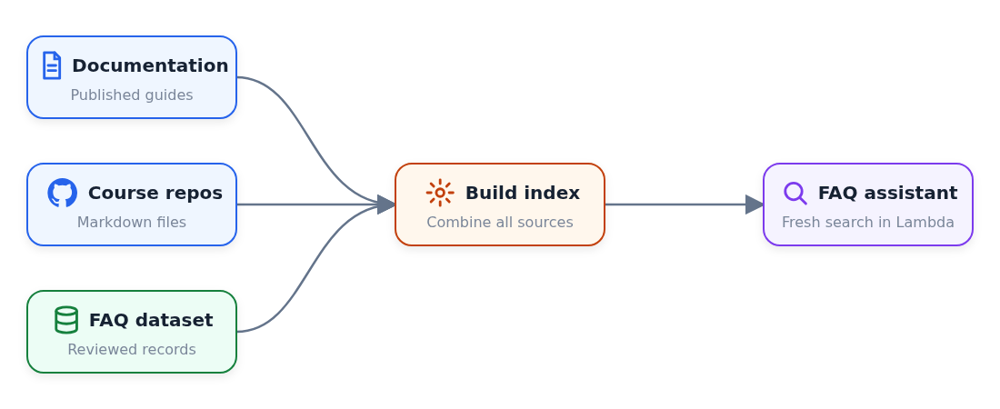
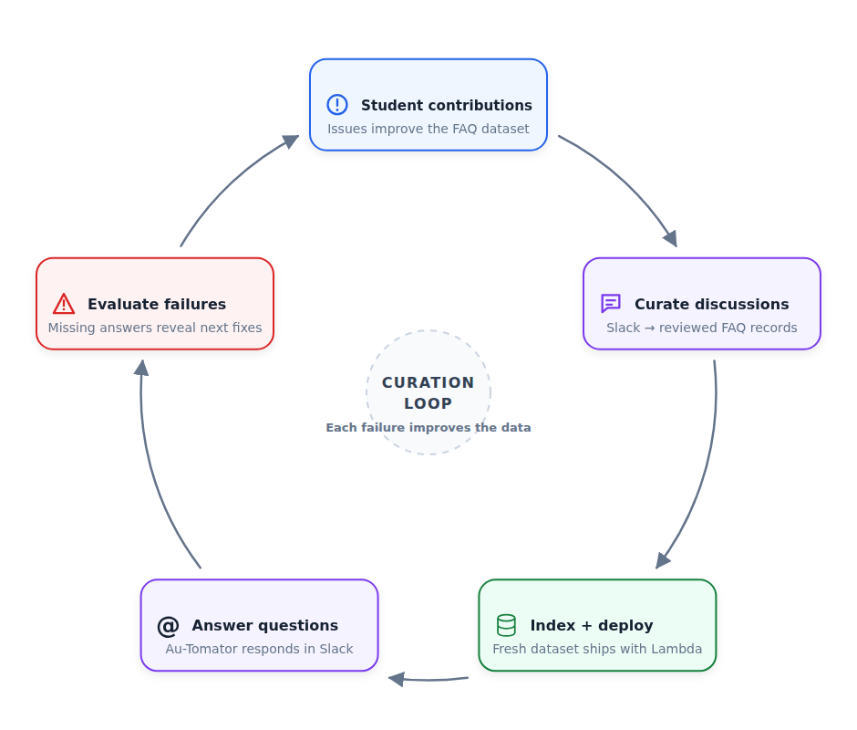

# Diagram Creator

[](https://github.com/alexeygrigorev/diagram-creator/actions/workflows/tests.yml)

Diagram Creator turns a compact JSON specification into a deterministic SVG or
PNG. The same renderer handles horizontal workflows, explicitly positioned
rows and columns, and five-step circular loops with reusable icons.

## Quick start

Install the project and render an example:

```bash
uv sync --dev
uv run diagram-creator examples/faq-curation-loop.json examples/faq-curation-loop.svg
```

Choose the format with the output extension. PNG output is rendered from the
same SVG with Chromium, so both formats use identical layout, fonts, and icons:

```bash
uv run diagram-creator input.json output.svg
uv run diagram-creator input.json output.png
```

Canvas dimensions belong in JSON. `--width` and `--height` can override them
for a one-off render.

## Examples

Each image below is generated from the linked JSON source.

### Horizontal workflow

The default layout evenly spaces a workflow from left to right and can route a
feedback edge below the main flow.


[JSON source](examples/agent-workflow.json) · [SVG output](examples/agent-workflow.svg)

### Manual rows and columns

Manual layout gives nodes explicit positions while retaining the same cards,
icons, anchors, and curved connectors.



[JSON source](examples/manual-pipeline.json) · [SVG output](examples/manual-pipeline.svg)

### Circular improvement loop

Ring layout places five equal cards clockwise and derives mirrored connector
curves automatically.



[JSON source](examples/faq-curation-loop.json) · [SVG output](examples/faq-curation-loop.svg)

## Diagram specification

Every diagram has nodes and edges. The original compact form remains valid and
uses a 1440×360 horizontal layout:

Set `"bidirectional": true` on an edge to render a single straight or curved
connector with arrowheads at both ends.

```json
{
  "nodes": [
    {"id": "plan", "title": "Plan", "subtitle": "PM", "color": "purple"},
    {"id": "build", "title": "Build", "subtitle": "Engineer", "color": "blue"}
  ],
  "edges": [
    {"from": "plan", "to": "build"},
    {"from": "build", "to": "plan", "label": "FAIL", "color": "red", "route": "below"}
  ]
}
```

Use a ring layout for a five-stage improvement cycle. Nodes are declared
clockwise starting at the top, and the renderer produces symmetric cards and
curves:

```json
{
  "title": "Continuous improvement loop",
  "canvas": {"width": 1100, "height": 550, "background": "#ffffff"},
  "layout": {"type": "ring", "card_width": 260, "card_height": 100},
  "nodes": [
    {"id": "one", "title": "Contribute", "color": "blue", "icon": "issue"},
    {"id": "two", "title": "Curate", "color": "purple", "icon": "message"},
    {"id": "three", "title": "Deploy", "color": "green", "icon": "database"},
    {"id": "four", "title": "Answer", "color": "purple", "icon": "mention"},
    {"id": "five", "title": "Evaluate", "color": "red", "icon": "warning"}
  ],
  "edges": [
    {"from": "one", "to": "two", "route": "ring"},
    {"from": "two", "to": "three", "route": "ring"},
    {"from": "three", "to": "four", "route": "ring"},
    {"from": "four", "to": "five", "route": "ring"},
    {"from": "five", "to": "one", "route": "ring"}
  ],
  "center": {"title": "CURATION", "subtitle": "LOOP", "detail": "Keep improving"}
}
```

The complete source for the diagram above is
[`examples/faq-curation-loop.json`](examples/faq-curation-loop.json).

### Layouts

- `horizontal` places every node in one evenly spaced row.
- `ring` places exactly five equal cards clockwise around a center annotation.
- `grid` places nodes by `row` and `column`, sizes each column and row to its
  largest node, and preserves equal `column_gap` and `row_gap` gutters. Set
  `column_width` and `row_height` when every grid cell should use fixed dimensions.
- `manual` uses each node's `x` and `y`; set shared `card_width` and
  `card_height` in `layout`, or override `width` and `height` on a node.

Manual layouts still use reusable cards and icons—the JSON controls placement,
not raw SVG markup:

```json
{
  "canvas": {"width": 900, "height": 500},
  "layout": {"type": "manual", "card_width": 220, "card_height": 100},
  "nodes": [
    {"id": "source", "title": "Sources", "x": 40, "y": 60, "icon": "document"},
    {"id": "index", "title": "Build index", "x": 340, "y": 280, "icon": "settings"}
  ],
  "edges": [
    {
      "from": "source",
      "to": "index",
      "route": "curve",
      "from_anchor": "right",
      "to_anchor": "top",
      "controls": [[300, 110], [450, 190]]
    }
  ]
}
```

Use `"variant": "icon"` for a standalone icon with its `title` underneath and
no surrounding card. Add `"show_label": false` when the icon should appear
without a visible label; the title remains available to the diagram's
accessible description. Set `"icon_size"` when a symbol needs an explicit
override. Standalone `user`, `browser`, and `database` icons otherwise use the
shared 56×56 px, 160×112 px, and 84×84 px dimension tokens respectively.

Use `"variant": "plain"` for a card without its rectangle. The node keeps the
same grid cell, icon column, and typography, but drops the fill, border, and
shadow, so it reads as a label rather than a component. A plain node with an
icon left-aligns its subtitle on the title axis because there is no card to
center against.

Add `"dividers"` to a grid diagram to separate rows with a dashed rule. Each
entry takes `after_row`, and the rule is drawn halfway between that row and the
one below it across the full grid width:

```json
"dividers": [{"after_row": 0}, {"after_row": 1}]
```

### Components and tokens

Node colors are `purple`, `blue`, `amber`, `green`, `red`, and `gray`.
Available icons are `github`, `search`, `database`, `openai`, `issue`,
`document`, `user`, `browser`, `websocket`, `api`, `settings`, `pull-request`,
`rank-fusion`, `message`, `video`, `sparkles`, `check`, `warning`, `close`,
`mention`, `number-1`, `number-2`, and `number-3`.

Cards use one component system: a 16 px inset, 28 px icon viewport, fixed text
axis, centered subtitle, 2 px semantic border, 18 px radius, and a shared
shadow. Long titles are fitted into the available text column automatically.

Edge routes are `forward`, `below`, `straight`, `curve`, and `ring`. Explicit
edges accept `from_anchor` and `to_anchor` values of `left`, `right`, `top`, or
`bottom`. A curve takes exactly two absolute `[x, y]` control points.

## Codex skill

The repository includes a reusable skill in
[`skills/diagram-creator`](skills/diagram-creator). Copy that directory into a
Codex skills directory to make it available across projects.

The skill also contains `scripts/publish_svgs.py`. It renders every local SVG
referenced by a Markdown article as a same-name PNG and changes the article
references only after all renders succeed:

```bash
python skills/diagram-creator/scripts/publish_svgs.py path/to/article.md
```

## Development

Run the checks:

```bash
make lint
make test
```

Read [How the renderer works](docs/how-it-works.md) for the drawing and routing
model.
