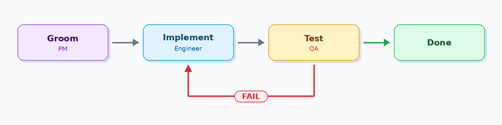

# Diagram Creator

Diagram Creator turns a small JSON specification into a polished horizontal
workflow diagram. Labels and arrows stay exactly as specified, while cards and
feedback loops use consistent geometry.



## Quick start

Install the project and render the included example:

```bash
uv sync --dev
uv run diagram-creator examples/agent-workflow.json examples/agent-workflow.png
```

The command accepts an input JSON file and an output PNG path:

```bash
uv run diagram-creator input.json output.png
```

The default canvas is 1440 by 360 pixels.

Set a different size when the workflow needs more room:

```bash
uv run diagram-creator input.json output.png --width 1800 --height 480
```

## Diagram specification

Define nodes in display order and reference their IDs from each edge:

```json
{
  "nodes": [
    {"id": "groom", "title": "Groom", "subtitle": "PM", "color": "purple"},
    {
      "id": "implement",
      "title": "Implement",
      "subtitle": "Engineer",
      "color": "blue"
    },
    {"id": "test", "title": "Test", "subtitle": "QA", "color": "amber"}
  ],
  "edges": [
    {"from": "groom", "to": "implement"},
    {"from": "implement", "to": "test"},
    {
      "from": "test",
      "to": "implement",
      "label": "FAIL",
      "color": "red",
      "route": "below"
    }
  ]
}
```

Use `route: "forward"` for the main flow and `route: "below"` for a feedback
loop. Nodes and edges share six colors: `purple` / `blue` / `amber` / `green` /
`red` / `gray`.

## Codex skill

The repository includes a reusable skill in
[`skills/diagram-creator`](skills/diagram-creator). Copy that directory into
your Codex skills directory to make it available across projects.

## How it works

Read [How the renderer was created](docs/how-it-works.md) for the original
ASCII diagram, the drawing sequence, and the layout decisions.

## Development

Run the checks:

```bash
make lint
make test
```

Python and Pillow render each image, `uv` manages the environment, and pytest
and Ruff check the project.
