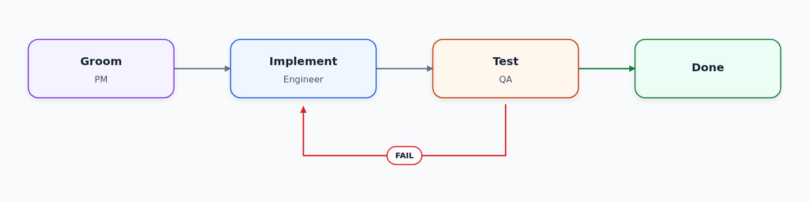
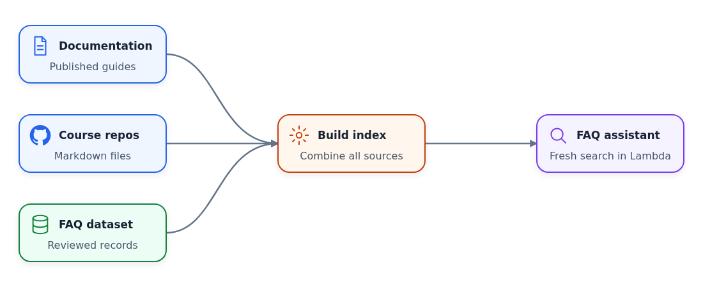
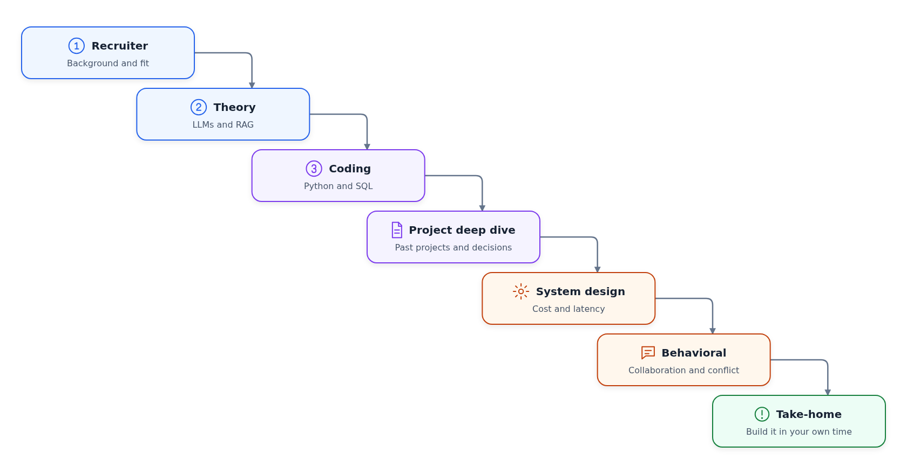
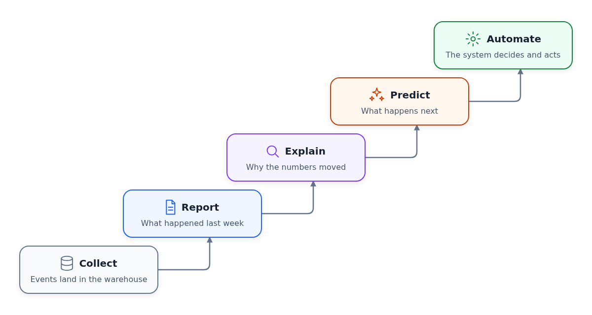
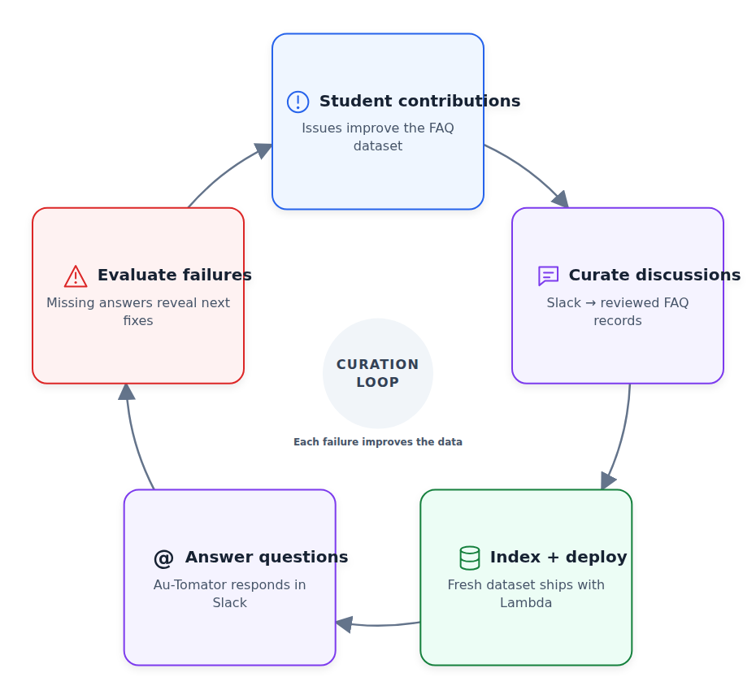

# Diagram Creator

[](https://github.com/alexeygrigorev/diagram-creator/actions/workflows/tests.yml)


[](https://github.com/astral-sh/ruff)

Workflow diagrams from a small JSON file — deterministic SVG and PNG output,
with layout, icons, arrows, and text fitting handled by the renderer instead of
your mouse.



Because the diagram *is* code, it lives in your repository: the spec diffs in
pull requests, the output is reproducible, and regenerating every figure in a
project is a one-line loop. When a layout cannot fit, the renderer refuses with
a suggested canvas size instead of producing a broken image.

## Quick start

No install, if you have [uv](https://docs.astral.sh/uv/):

```bash
uvx --from git+https://github.com/alexeygrigorev/diagram-creator \
  diagram-creator spec.json diagram.png
```

Or clone and work on the project itself:

```bash
git clone https://github.com/alexeygrigorev/diagram-creator
cd diagram-creator && uv sync --dev
uv run diagram-creator examples/faq-curation-loop.json examples/faq-curation-loop.png
```

The output format follows the file extension. `.svg` writes vector graphics;
`.png` rasterizes the same SVG with headless Chromium (any of `chromium`,
`chromium-browser`, `google-chrome`, or `google-chrome-stable` on `PATH`), so
both formats always agree on layout, fonts, and icons.

`--width` and `--height` override the JSON canvas for a one-off render,
`--style` switches the visual style, and `--version` prints the version.

## Examples

Every image below is generated from the linked JSON source.

**Horizontal** — the default layout spaces a pipeline left to right and can
route a feedback edge below the main flow:


[JSON](examples/agent-workflow.json) · [SVG](examples/agent-workflow.svg)

**Manual** — explicit `x`/`y` positions, same cards, icons, anchors, and curved
connectors:


[JSON](examples/manual-pipeline.json) · [SVG](examples/manual-pipeline.svg)

**Staircase** — equal cards cascade one step right and one step down, joined by
single elbows; `"direction": "ascending"` climbs instead:


[JSON](examples/interview-stages.json) · [SVG](examples/interview-stages.svg)


[JSON](examples/analytics-maturity.json) · [SVG](examples/analytics-maturity.svg)

**Ring** — equal cards spaced on a real circle, connectors drawn as arcs of
that same circle, around a center annotation:


[JSON](examples/faq-curation-loop.json) · [SVG](examples/faq-curation-loop.svg)

## The spec in one minute

Every diagram is nodes and edges. This minimal spec is valid as-is and renders
as a 1440×360 horizontal pipeline:

```json
{
  "title": "Feature delivery",
  "description": "One sentence a reader should take away; becomes the SVG <desc> and image alt text.",
  "nodes": [
    {"id": "plan", "title": "Plan", "subtitle": "PM", "color": "purple"},
    {"id": "build", "title": "Build", "subtitle": "Engineer", "color": "blue"},
    {"id": "ship", "title": "Ship", "color": "green"}
  ],
  "edges": [
    {"from": "plan", "to": "build"},
    {"from": "build", "to": "plan", "label": "FAIL", "color": "red", "route": "below"},
    {"from": "build", "to": "ship"}
  ]
}
```

Everything else is optional and additive: canvas and layout at the top level,
then per-node and per-edge options.

### Nodes

| Field | Meaning |
| --- | --- |
| `id`, `title`, `subtitle` | Identity and card text; titles are auto-fitted, never squeezed |
| `color` | `purple`, `blue`, `amber`, `green`, `red`, `gray` |
| `icon` | One of the [icon names](#icons) below |
| `eyebrow` | Small line above the title |
| `x`, `y`, `width`, `height` | Position and size (manual layout) |
| `row`, `column` | Position (grid layout) |
| `variant` | `card` (default), `icon`, `plain`, `boundary`, `attached`, `specimen` |
| `show_label`, `icon_size` | For `icon` variant: hide the caption, resize the symbol |

The canvas is `"canvas": {"width": ..., "height": ..., "background": ...}`;
without one you get the 1440×360 horizontal default. Titles and subtitles are
never stretched or squeezed: each diagram picks one title size and one subtitle
size — the largest that fits every card — so type stays consistent and every
glyph keeps its natural width.

### Edges

| Field | Meaning |
| --- | --- |
| `from`, `to` | Node ids |
| `label` | Short pill label, measured so it cannot cover an arrowhead or a card |
| `color` | Semantic edge color |
| `route` | `forward` (default), `below`, `straight`, `curve`, `orthogonal`, `ring`, `step` |
| `from_anchor`, `to_anchor` | `left`, `left_top`, `left_bottom`, `right`, `right_top`, `right_bottom`, `top`, `bottom` |
| `controls` | Exactly two absolute `[x, y]` points, for `curve` |
| `dashed`, `directed`, `bidirectional` | Dashed stroke, no arrowheads, arrowheads on both ends |

`forward` draws a straight arrow in row-like layouts; inside a staircase it
becomes a `step`, which leaves one card through its side, turns once halfway
across the gap, and enters the next card's top or bottom (also usable in grid
and manual layouts). `orthogonal` draws a deliberate 90° elbow, `below` loops a
feedback edge under the main flow, and `curve` with explicit `controls` covers
the rare relationship the others cannot express.

## Layouts

| Type | Use it for | Key options |
| --- | --- | --- |
| `horizontal` (default) | Left-to-right pipelines | — |
| `grid` | Rows × columns with aligned cells | `row`, `column` per node; `column_gap`, `row_gap`, or fixed `column_width` / `row_height` |
| `staircase` | Sequential stages | `direction` (`descending` / `ascending`), `step_x`, `step_y`, `margin` |
| `ring` | Improvement cycles (3+ nodes) | `card_width`, `card_height`, `margin`, `center` annotation |
| `manual` | Full placement control | `x`, `y` per node; shared `card_width` / `card_height`; `dividers` |

Ring layout spaces cards evenly on a circle, clockwise from the top, around a
`center` annotation, and fits the largest circle the canvas allows — give a
ring a roughly square canvas; a wide one only adds side margins. Staircase
cascades cards in JSON order, spreads the treads over the canvas width, and
supports exact advances via `step_x`/`step_y`. When a ring or staircase cannot
fit, rendering fails with a suggested canvas size.

Two card options work in any layout. `font_scale` scales card type and its
vertical rhythm together, for a diagram that must stay legible on a phone.
`icon_position: "block"` puts the icon over a centered title and needs roughly
half the card width of `inline`, which makes cards squarer. Grid and manual
layouts share one icon and title axis across comparable cards; set
`"fixed_icon_axis": false` for per-card optical centering, or `true` to opt an
automatic layout in.

Grid and manual diagrams can separate rows with dashed rules:

```json
"dividers": [{"after_row": 0}, {"after_row": 1}]
```

In a manual layout, `after_node` draws the rule below one named node instead,
so coordinate-placed nodes do not need bookkeeping rows:

```json
"dividers": [{"after_node": "before_state"}]
```

### Variants

- `"variant": "icon"` — a standalone icon with its `title` underneath and no
  surrounding card. Connectors attach to the visible artwork, not the
  transparent padding around it.
- `"variant": "plain"` — a card without its rectangle: same grid cell, icon
  column, and typography, but no fill, border, or shadow, so it reads as a
  label rather than a component.
- `"variant": "boundary"` (manual layout) — a dashed infrastructure or runtime
  boundary behind related nodes: give it `x`, `y`, `width`, `height`, list the
  members in `contains`, and its title sits in the top-left corner. Connectors
  entering or leaving the group get a background halo, so they cross the dashed
  stroke through a clean port.
- `"variant": "attached"` — a small sidecar note pinned to another card with
  `attach_to`, `attach_side`, and `attach_align`.
- `"variant": "specimen"` — a data-shaped panel (`series`, `record`, or
  `waterfall` modes) for showing rows, tuples, or cumulative bars inside a
  diagram.

Cards share one component system — icon anchored to the left edge with the
subtitle on the same margin, centered text when there is no icon, one shadow,
one corner radius everywhere.

### Colors and icons

Node colors: `purple`, `blue`, `amber`, `green`, `red`, `gray`.

<a id="icons"></a>Available icons: `alert`, `api`, `aws`, `browser`, `check`,
`close`, `collector`, `container`, `database`, `document`, `environment`,
`github`, `issue`, `lambda`, `mention`, `message`, `number-1`, `number-2`,
`number-3`, `observability`, `openai`, `pull-request`, `queue`, `rank-fusion`,
`registry`, `robot`, `search`, `settings`, `shell`, `shield`, `sparkles`,
`terminal`, `user`, `video`, `volume`, `warning`, `websocket`, `workflow` —
use `terminal` for a terminal-emulator window and `shell` for the command
interpreter inside it.

## Styles

Diagrams render in one of three named styles: `default` (the original light
look), `asl-light`, and `asl-dark`. The ASL styles match AI Shipping Labs: a
neutral scale where the brand lime accent carries the green role, Inter for
cards and JetBrains Mono for code, and — for `asl-dark` — dark tinted card
fills with bright strokes on a near-black canvas.

Set the style in JSON, where it also decides the default canvas background:

```json
{
  "style": "asl-dark",
  "canvas": {"width": 940, "height": 300},
  "...": "..."
}
```

Or override it per render without touching the spec:

```bash
uv run diagram-creator input.json output.svg --style asl-light
uv run diagram-creator input.json output.png --style asl-dark
```

An explicit `"background"` in `canvas` still wins over the style's default.

## Guardrails

The CLI prints `note:` advisories on stderr when a spec renders but will read
worse than it could: a manual-layout canvas visibly larger than its content, or
a missing `description` (which becomes the SVG `<desc>` and the article's alt
text). Advisories never fail the render; fix the spec and rerun. Hard failures
— overlapping ring cards, a staircase that does not fit, a label with no
gutter — come with the numbers to fix them, usually a suggested canvas size.

## Python API

```python
from diagram_creator import load_spec, render_diagram

spec = load_spec("spec.json")
render_diagram(spec, "diagram.svg")
render_diagram(spec, "diagram.png", style="asl-dark")
```

`render_diagram` returns the output path and accepts optional `width`,
`height`, and `style` overrides; invalid specs raise `SpecError`.

## Use it as an agent skill

The repository ships a reusable skill in
[`skills/diagram-creator`](skills/diagram-creator). Copy that directory into
your agent's skills directory to make it available across projects.

The skill also contains `scripts/publish_svgs.py`. It renders every local SVG
referenced by a Markdown article as a same-name PNG and changes the article
references only after all renders succeed:

```bash
python skills/diagram-creator/scripts/publish_svgs.py path/to/article.md
```

## Development

```bash
make setup     # uv sync --dev
make lint      # ruff check + format check
make test      # pytest
make coverage  # pytest with term-missing coverage
make example   # render examples/agent-workflow.png
```

To re-render every example after changing the renderer:

```bash
for f in examples/*.json; do uv run diagram-creator "$f" "${f%.json}.svg"; done
```

Read [How the renderer works](docs/how-it-works.md) and the
[design system](docs/design-system.md) for the drawing, routing, and styling
model.

## License

[MIT](LICENSE)
